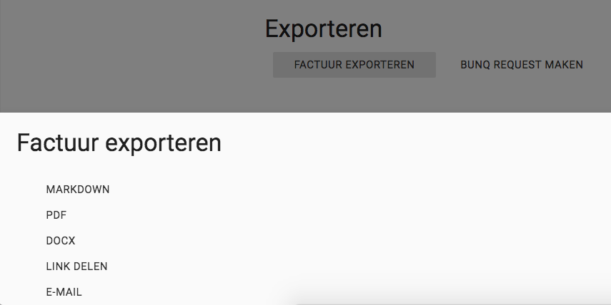
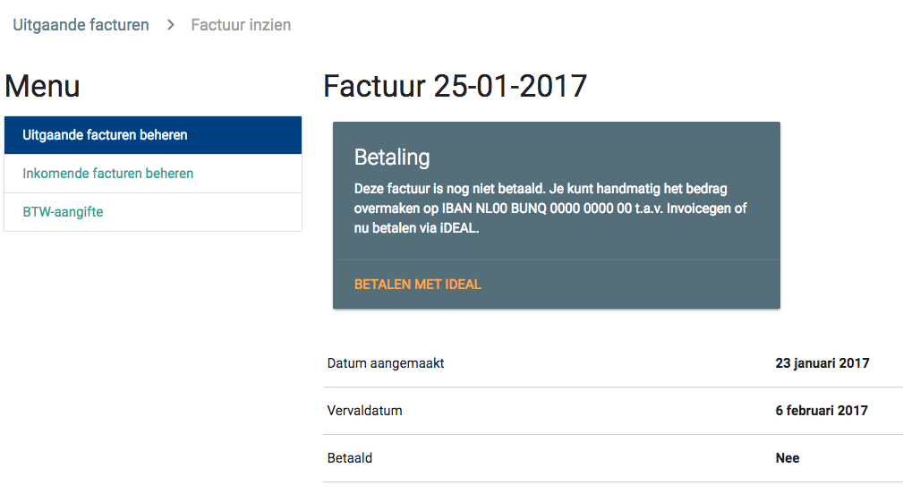

Facturen
========
Je facturen vind je onder het kopje `Facturen`. Deze sectie is onderverdeeld in Uitgaande en Inkomende facturen. Ook kun je hier hulp vinden met de BTW-aangifte.

Uitgaande facturen
------------------
Op de pagina Uitgaande facturen vind je een tabel met facturen per jaar. Je maakt een nieuwe factuur aan door rechtsonder op de plus te klikken, maar handiger is om via Opdrachten een reeks opdrachten te selecteren en op de knop *Factureren* te klikken. Via de plus-knop kun je echter hetzelfde bereiken, maar dan moet je handmatig uit de lijst kiezen welke opdrachten je wilt factureren. Je kunt hier ook een vervaldatum en volgnummer instellen. Klik op *Opslaan* om je factuur op te slaan.

Daarna kom je op de factuurpagina. Hier zie je de opdrachten die gefactureerd worden, de opdrachtgever en het totaalbedrag. Je kunt vanaf deze pagina ook de factuur exporteren naar pdf, docx of Markdown, of je kunt een link maken en die delen met je opdrachtgever. Deze kan dan de link in de browser openen en ziet dezelfde informatie als jij. Je kunt de factuur ook per e-mail versturen als pdf-bijlage of met de link.

bunq request
~~~~~~~~~~~~
Vanaf de factuurpagina heb je de optie om een bunq request te maken. Die optie komt echter alleen te voorschijn als je een bunq-api-key hebt toegevoegd. Om een API-key toe te voegen, ga je naar *Instellingen* bovenin en dan naar *Algemene instellingen*. Vul bij *Bunq API Key* je api-sleutel in en druk op *Opslaan*. Je bunq-rekeningen verschijnen dan in de lijst bij de rekeningen. Kies de bunq-rekening waar vanaf je de request wilt versturen en klik weer op *Opslaan*.

Terug op de factuurpagina zie je nu naast *Factuur exporteren* de knop *bunq request*. Klik erop, verifieer of het e-mailadres van je opdrachtgever klopt en klik op *Versturen* om de bunq request te versturen. Zodra degene betaalt, zie je dat terug in het *Actviteiten*-overzicht.

Mollie iDEAL
~~~~~~~~~~~~
Je hebt ook de optie om facturen te laten betalen via iDEAL. Daarvoor is het nodig om eerst een je Mollie-API-sleutel in Invoicegen in te vullen. Dat doe je bij *Instellingen* / *Algemene instellingen*. Vul dan je api-sleutel bij *Mollie API-sleutel* in en klik op *Opslaan*.

Om nu je factuur te laten betalen via iDEAL, klik je op *Factuur exporteren / Link delen*. Als je de link verstuurt naar iemand, verschijnt onder de factuurtitel de optie om de factuur met iDEAL te betalen. Zodra de factuur betaald is, verandert de status van de fatuur automatisch naar `Betaald`.

Inkomende facturen
------------------
Als je een factuur ontvangt of kosten hebt gemaakt, kun je deze facturen toevoegen bij de inkomende facturen. Voeg met de plusknop rechtsonder een nieuwe inkomende factuur toe door de gevraagde gegevens in te vullen. Upload als bijlage eventueel het pdf-bestand van de factuur en sla de factuur op.

Btw-aangifte
------------
Om je te helpen met de btw-aangifte, kan Invoicegen automatisch alle inkomende en uitgaande facturen op een rij zetten en de btw verrekenen. Elk kwartaal wordt dit overzicht automatisch bijgewerkt met de nieuwste informatie. Helaas heeft IG geen directe integratie met de btw-aangifte dus kan het niet direct de btw-aangifte voor je doen. Rechts kun je ook zelf een periode kiezen.
