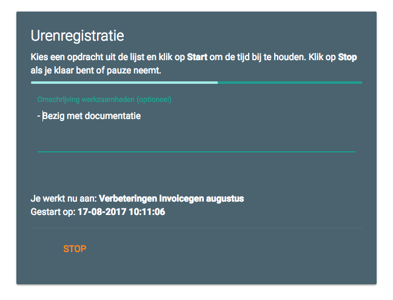
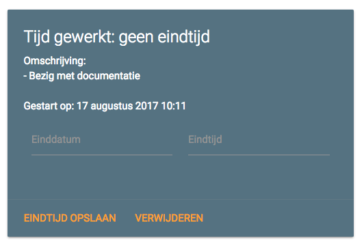

Opdrachten
==========

Om je opdrachten te beheren, ga je bovenin naar het tabblad *Opdrachten*. In deze index zie je de opdrachten-tabel. In die tabel staan de opdrachten onderverdeeld per jaar en openstaande opdrachten.

Opdracht toevoegen
------------------
Om je eerste opdracht toe te voegen, klik je rechtsonder op de plus. Vul nu de gevraagde gegevens in, zoals de titel, eventueel een volgnummer van de opdracht en wie de opdrachtgever is. Klik op *Nieuwe opdrachtgever toevoegen* om de gegevens van de opdrachtgever op te slaan. Daarna kun je deze opdrachtgever uit de lijst kiezen. Je kunt eventueel ook bijlages uploaden, zoals een uitgebreide briefing of offerte of wat dan ook. Sla daarna de opdracht op.

Opdrachten beheren
------------------
In de tabel kun je opdrachten beheren, zoals deze verwijderen of aanpassen. Als je opdracht af is, selecteer je deze in de tabel *openstaand* met het selectievakje links en klik je onderaan op de knop *Opdrachten afgerond*. De pagina herlaadt en de opdracht is verplaatst naar het relevante jaartal.
Opdrachten in de tabel van een jaar kun je factureren op dezelfde manier: selecteer deze met de selectievakjes en klik op de knop *Factureren*. Vul een volgnummer in van de factuur en Invoicegen maakt de facturen aan.

Tijd bijhouden
--------------
Voordat een opdracht af is, wil je natuurlijk wel weten hoeveel tijd je eraan besteedt. Je kunt je tijd bijhouden bij Invoicegen met *Urenregistratie*. Kies daar de opdracht uit de lijst waaraan je nu gaat werken en klik op *Start* om de tijd nu vast te leggen. Je bent nu 'aan het werk'. Je kunt in het tekstvak *Omschrijving werkzaamheden* opschrijven waaraan je mee bezig bent. Tekst die je daar intypt wordt automatisch opgeslagen: dus ook als je een andere pagina bezoekt of de pagina vernieuwt. Zodra je stopt met werken, klik je op *Stop* om de eindtijd op te slaan.

Vergeet je op stop te klikken, dan ga je naar de Opdrachtenpagina van de betreffende opdracht door er in de tabel op te klikken. Bij *Urenregistraties* zie je de tijd gewerkt aan een opdracht. Je kunt hier voor een urenregistratie zonder eindtijd nog een eigen eindtijd instellen. Klik dan op *Eindtijd opslaan*.
Op de detailpagina van een opdracht kun je alle urenregistraties inzien samen met de totaalgewerkte tijd.

Opdrachtegevers beheren
-----------------------
Links in het zij-menu vind je de optie om opdrachtgevers te beheren. Hier kun je nieuwe opdrachtgevers toevoegen en gegevens wijzigen.