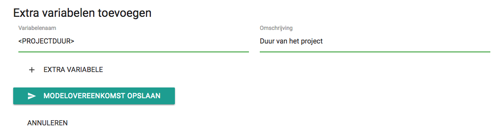
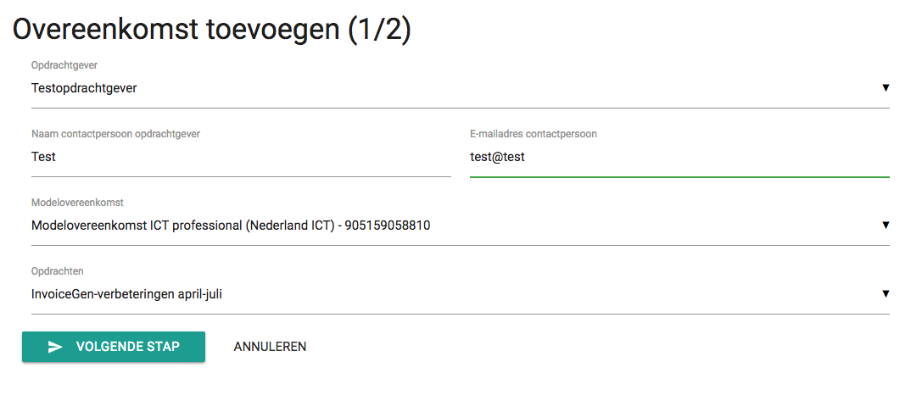
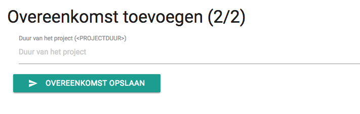
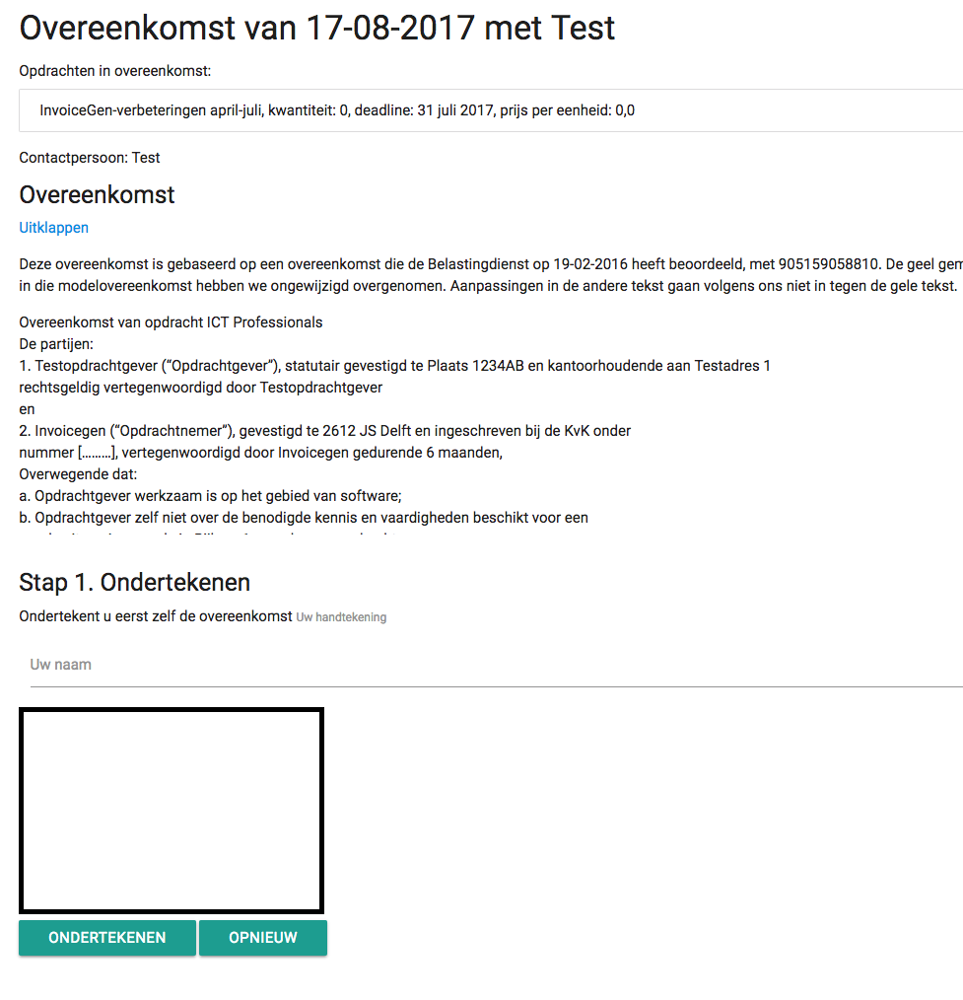

Overeenkomsten
==============

Invoicegen helpt je met het maken van overeenkomsten met je opdrachtgevers. Hiervoor ga je bovenin naar *Overeenkomsten*.

Modelovereenkomsten
-------------------

Voordat je een overeenkomst kunt sluiten met je opdrachtgever, is het nodig om eerst een modelovereenkomst toe te voegen. Daarvoor ga je links naar *Modelovereenkomsten beheren* en klik je rechtsonder op de plus-knop om een nieuwe modelovereenkomst toe te voegen.

Voer de titel in van de modelovereenkomst en daarna de modelovereenkomst zelf, die je bijvoorbeeld kunt kopieren en plakken van de belastingdienst. Je kunt de tekst in dit veld opmaken met Markdown_. Ga dan de modelovereenkomst door en gebruik de variabelen die erboven staan in de modelovereenkomst. Wil je dat bijvoorbeeld ergens jouw naam in de overeenkomst wordt geprint, dan vul je op die plek dus `<MIJN_NAAM>` in. Je kunt dat doen voor alle erboven genoemde variabelen.

Helaas is dat vaak niet genoeg en zijn er per overeenkomst nog andere gegevens die ingevuld moeten worden. Daarom kun je onder de modelovereenkomst nog eigen variabelen toevoegen voor gegevens die bij die modelovereenkomst horen. Wil je bijvoorbeeld bij deze modelovereenkomst de projectduur vastleggen, dan vul je bijvoorbeeld als variabelenmaam <PROJECTDUUR> in en als omschrijving `Duur van het project`. Gebruik die variabele dan in de modelovereenkomst.
Heb je alle variabelen en gegevens ingevuld, klik dan op *Modelovereenkomst opslaan*.

Overeenkomst toevoegen
----------------------
Als je nu een nieuwe overeenkomst wilt sluiten met je opdrachtgever, ga je terug naar *Overeenkomsten* en klik je rechtsonder op de plus-knop. Kies de opdrachtgever voor wie de overeenkomst bedoeld is en vul de naam en e-mail van een contactpersoon in. Kies de modelovereenkomst uit de lijst die je voor deze opdracht wilt gebruiken en kies de opdracht(en) waarvoor de overeenkomst bedoeld is. Klik dan op *Volgende stap*.

Als er eventueel extra variabelen zijn gekoppeld aan de modelovereenkomst, is het nodig om die informatie nu in te vullen. In ons voorbeeld vul je nu dan dus de projectduur in, bijvoorbeeld `6 maanden`. Open nu de overeenkomst.

Vul dan je naam in en teken in het kader je handtekening en klik op *Ondertekenen*. Kopieer en plak dan de link die je verkrijgt en verstuur die naar de opdrachtgever, die vervolgens op eenzelfde manier de opdracht kan ondertekenen. Zodra die ondertekend is, zie je op deze pagina beide handtekeningen.

.. _Markdown: https://daringfireball.net/projects/markdown/syntax